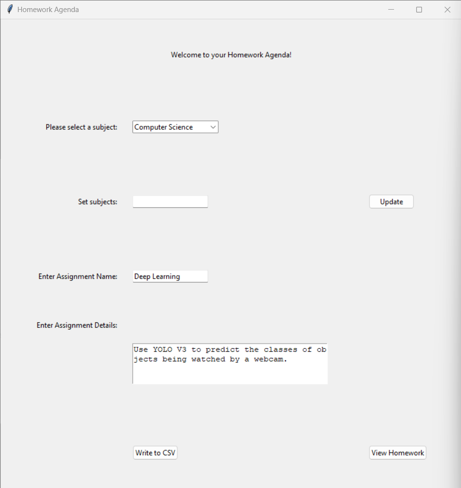
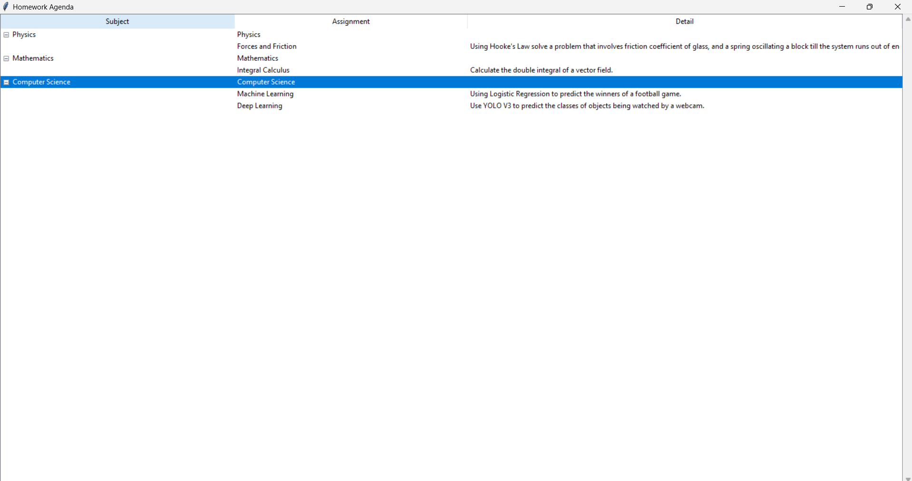

# Homework_Agenda

This is a Tkinter desktop application that allows users to record their homework assignments and display their homework assignments as well. It is a useful application just in time for school.

## GUI Appearance

This is the main GUI:

This is the display homework GUI:

## Acknowledgements

 - Professors at Kean University
 - Professors at NJIT
 - Research Mentors at Kean University
 - StackOverflow Q&A Discussion
 - ChatGPT
 - ClaudeAI

## Authors

- [@FPyC639](https://github.com/FPyC639)

## Appendix

